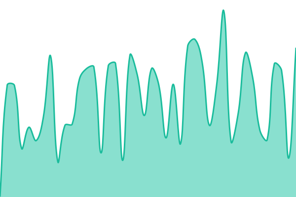
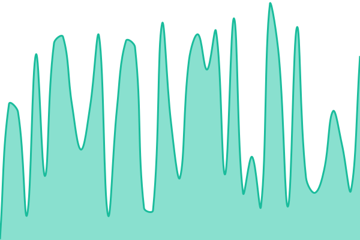
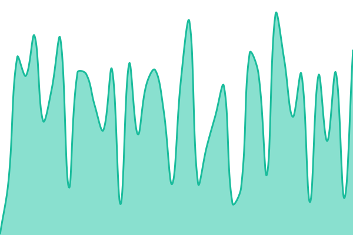

# [📈 Live Status](https://status.globetrotte.com/): <!--live status--> **🟧 Partial outage**

<!--start: status pages-->
<!-- This summary is generated by Upptime (https://github.com/upptime/upptime) -->
<!-- Do not edit this manually, your changes will be overwritten -->
<!-- prettier-ignore -->
| URL | Status | History | Response Time | Uptime |
| --- | ------ | ------- | ------------- | ------ |
|  [API](https://api.globetrotte.com/api/passwd) | 🟩 Up | [api.yml](https://github.com/binhonglee/GT-Status/commits/HEAD/history/api.yml) | 

 248ms
     
 | 

<a href="https://status.globetrotte.com/history/api">100.00%</a>
    

|  [Web](https://globetrotte.com) | 🟥 Down | [web.yml](https://github.com/binhonglee/GT-Status/commits/HEAD/history/web.yml) | 

 178ms
     
 | 

<a href="https://status.globetrotte.com/history/web">55.80%</a>
    

|  [AI Agent](https://api.globetrotte.com/api/agent_status) | 🟩 Up | [ai-agent.yml](https://github.com/binhonglee/GT-Status/commits/HEAD/history/ai-agent.yml) | 

 165ms
     
 | 

<a href="https://status.globetrotte.com/history/ai-agent">100.00%</a>
    

<!--end: status pages-->
